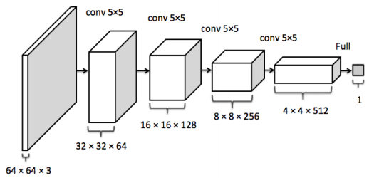
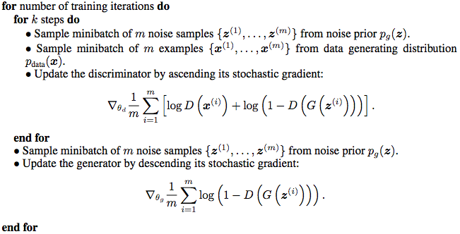

## GAN-discovery

A simple example to gain GAN's idea fast.

## Generator Architecture

## Discriminator Architecture

## Algorithms

## Reference
1. Dataset
2. [Generative Adversarial Nets](https://arxiv.org/pdf/1406.2661.pdf)
3. [Image Completion with Deep Learning in Tensorflow](http://bamos.github.io/2016/08/09/deep-completion)
4. [Semantic Image Inpainting with Deep Generative Models](https://arxiv.org/abs/1607.07539)
5. [Unsupervised Representation Learning with Deep Convolutional Generative Adversarial Networks](https://arxiv.org/abs/1511.06434)
6. [Probability Density Function](https://en.wikipedia.org/wiki/Probability_density_function)
7. [DCGANs](https://arxiv.org/abs/1511.06434)
